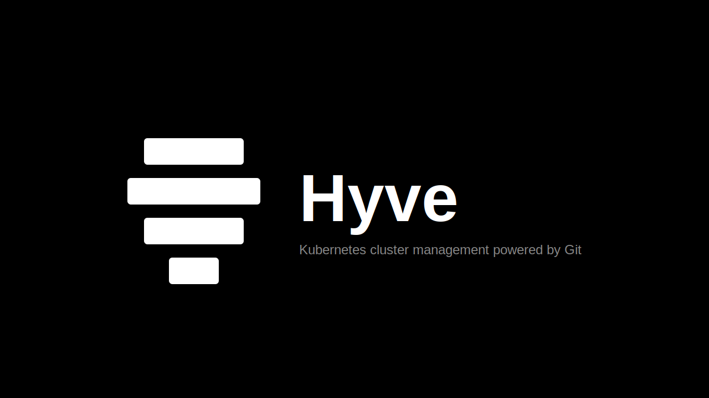

<p align="center">
  
</p>

# Hyve

A GitOps-first Kubernetes cluster management CLI. Define clusters as YAML, commit the change, and Hyve reconciles the desired state against your cloud provider — locally or through a CI/CD pipeline.

Supports **Civo, AWS (EKS), GCP (GKE), and Azure (AKS)** with multi-account credential routing, strict delete enforcement, automated post-deploy workflows, and encrypted kubeconfig storage.

[](https://hyve.mintlify.app)
[](LICENSE)

## Features

- **GitOps Native** - All cluster state managed through Git repositories
- **Multi-Repository** - Separate repos for dev/staging/prod environments
- **Automated Workflows** - Define deployment pipelines with requirements validation
- **Cluster Templates** - Reusable cluster patterns with automated workflows
- **Variable Substitution** - Full shell support with workflow and environment variables

## Why Hyve?

General-purpose IaC tools (Terraform, Pulumi, Crossplane) are built to manage any cloud resource. That generality is a good fit for VPCs, IAM roles, and databases — resources that are provisioned once and live for years. It becomes friction when the resource is a Kubernetes cluster that a team actively creates, destroys, and recreates on a regular cadence.

**Git is the state backend.** Most IaC tools require a separate remote state backend with locking, versioning, and access control. Hyve's state is the Git repository itself. No S3 bucket, no cloud account, no extra credentials — and the full history of every cluster change is already there.

**Continuous reconciliation, not plan-and-apply.** Traditional IaC models changes as a plan that must be reviewed and applied. For ephemeral environments this ceremony adds friction to every iteration. Hyve reconciles continuously: commit to create, delete the file to destroy, update a field to change. The same `hyve reconcile` command handles all three cases.

**Post-provision automation is built in.** After a cluster becomes active you typically need to install controllers, apply manifests, or run smoke tests. Most IaC tools require a separate orchestration layer for this. Hyve's `onCreated` and `onDestroy` workflow hooks run automatically as part of the same reconcile cycle.

**Consistent multi-cloud interface.** IaC providers are written independently, versioned separately, and expose provider-specific schemas. Hyve has first-party support for Civo, AWS EKS, GCP GKE, and Azure AKS behind a single YAML schema — the same structure and the same CLI commands across all four.

**Kubeconfig management is solved.** Most IaC tools output a kubeconfig as a sensitive value you then have to route somewhere useful. Hyve automatically retrieves, encrypts, and stores kubeconfigs on every reconcile and lets you merge any cluster into `~/.kube/config` with one command. Contexts are removed automatically when clusters are deleted.

## Documentation

Full documentation at **[hyve.mintlify.app](https://hyve.mintlify.app)** — CLI reference, guides, and provider configuration.

## Installation

Requires Go 1.21+ and Git in `PATH`.

**Using `go install`:**

```bash
go install github.com/cbridges1/hyve@latest
```

**From source:**

```bash
git clone https://github.com/cbridges1/hyve.git
cd hyve
go build -o hyve .
sudo mv hyve /usr/local/bin/
```

## Quick Start

```bash
# 1. Store Civo token (or use CIVO_TOKEN env var)
hyve config set-token civo

# 2. Add a state repository
hyve git add production --repo-url https://github.com/company/hyve-state.git

# 3. Create a cluster
hyve cluster add my-cluster --provider civo --region PHX1 --nodes g4s.kube.medium

# 4. Run a workflow
./hyve workflow run deploy-app --cluster my-cluster
```

## Development

[Task](https://taskfile.dev) is used to simplify common operations:

| Command | Description |
|---------|-------------|
| `task build` | Build the `hyve` binary |
| `task run -- [args]` | Build and run with arguments |
| `task dev -- [args]` | Run directly with `go run` |
| `task test` | Run all tests |
| `task test:verbose` | Run all tests with verbose output |
| `task test:race` | Run all tests with race detector |
| `task test:cover` | Run all tests with coverage report |
| `task test:report` | Run tests and generate JSON report |
| `task vet` | Run `go vet` |
| `task check` | Run vet and tests |
| `task tidy` | Tidy go modules |
| `task clean` | Remove binary and report artifacts |
