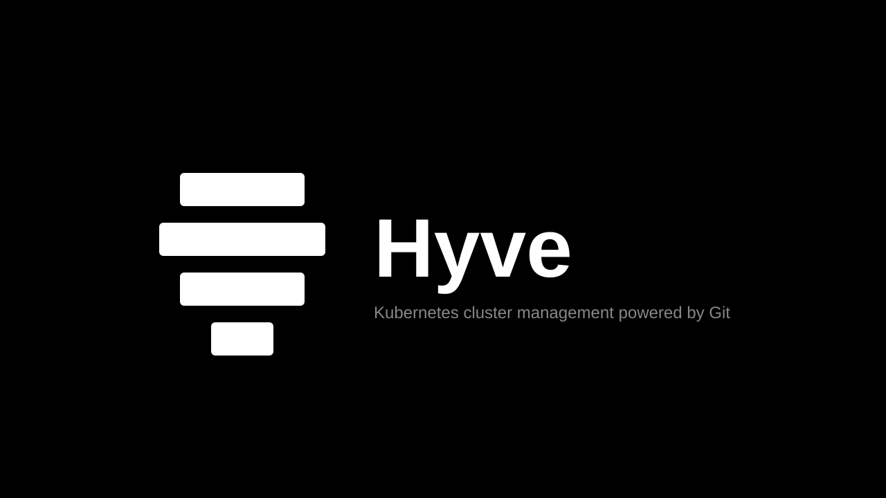

<p align="center">
  
</p>

# Hyve

A GitOps-first Kubernetes cluster management CLI. Define clusters as YAML, commit the change, and Hyve reconciles the desired state — locally or through a CI/CD pipeline. Cloud operations are delegated to **modules**: versioned, self-contained packages that implement cluster operations via shell scripts or workflow YAMLs. No cloud SDKs are embedded in Hyve itself.

[](https://cbridges1.github.io/hyve-website/)
[](LICENSE)

## Features

- **GitOps Native** — All cluster state lives in Git. Every change is version-controlled, reviewed through pull requests, and rolled back with a revert commit.
- **Module System** — Modules are versioned packages for any cloud provider. Install once, reference from any template. No cloud SDKs bundled.
- **Lifecycle Hooks** — `beforeCreate`, `onCreate`, `onDelete`, `afterDelete` — run arbitrary workflows at each stage of a cluster's lifecycle, automatically.
- **Cluster Templates** — Define the shape of a cluster once; execute the template by name to stamp out clusters consistently.
- **Variable Injection** — Module params are injected as `HYVE_PARAM_*` env vars. Workflow outputs flow back as `HYVE_KEY=value` lines and are persisted for the next reconcile.
- **Any Provider** — First-party modules for Civo, AWS EKS, GCP GKE, and Azure AKS. Community modules for anything else. Your credentials stay in your environment.

## Why Hyve?

**Git is the state backend.** No S3 bucket, no Terraform Cloud, no extra credentials — the full history of every cluster change is already in the repository.

**Continuous reconciliation, not plan-and-apply.** Commit to create, delete the file to destroy, update a field to reconcile the difference. The same `hyve reconcile` command handles all three cases.

**Lifecycle hooks are built in.** Four hook points cover the full cluster lifecycle:

| Hook | Cluster Exists? | When It Runs |
|------|-----------------|--------------|
| `beforeCreate` | No | Before provisioning — provision VPCs, IAM roles, etc. |
| `onCreate` | Yes | After the cluster is active — deploy apps, configure monitoring |
| `onDelete` | Yes | Before deletion — drain workloads, export backups |
| `afterDelete` | No | After deletion — destroy VPCs, release IPs, clean up roles |

**Modules, not embedded SDKs.** Old-style GitOps tools embed cloud SDKs. If your provider isn't supported, you're stuck. Hyve modules shell out to any CLI tool you already have configured — your credentials, your tools, your control.

## Documentation

Full documentation at **[cbridges1.github.io/hyve-website](https://cbridges1.github.io/hyve-website/)** — CLI reference, module authoring guide, and provider-specific walkthroughs.

## Installation

**Homebrew (macOS/Linux):**

```bash
brew install cbridges1/tap/hyve
```

**Binary download:**

Prebuilt binaries for macOS, Linux, and Windows (amd64/arm64) are attached to every [GitHub Release](https://github.com/cbridges1/hyve/releases).

```bash
curl -sL https://github.com/cbridges1/hyve/releases/latest/download/hyve_$(uname -s | tr '[:upper:]' '[:lower:]')_$(uname -m | sed 's/x86_64/amd64/;s/aarch64/arm64/').tar.gz | tar xz
sudo mv hyve /usr/local/bin/
```

**Docker:**

```bash
docker pull ghcr.io/cbridges1/hyve:latest
docker run --rm -v "$(pwd)":/repo ghcr.io/cbridges1/hyve:latest reconcile --path .
```

Requires Go 1.21+ and the system `git` binary in `PATH` for the options below.

**Using `go install`:**

```bash
go install github.com/cbridges1/hyve@latest
```

**From source (install to `$GOPATH/bin`):**

```bash
git clone https://github.com/cbridges1/hyve.git
cd hyve
go install .
```

Ensure `$(go env GOPATH)/bin` is in your `PATH`. This builds and installs the binary in one step with no manual copy required.

**From source (local binary):**

```bash
git clone https://github.com/cbridges1/hyve.git
cd hyve
go build -o hyve .
sudo mv hyve /usr/local/bin/
```

## Quick Start

```bash
# 1. Add a module
hyve module add github.com/hyve-modules/civo@v1.0.0

# 2. Point Hyve at a Git repository for state
hyve git add production --repo-url https://github.com/company/hyve-state.git

# 3. Create a template
hyve template create my-civo-template \
  --driver github.com/hyve-modules/civo \
  --driver-version v1.0.0 \
  --region PHX1 \
  --set node_size=g4s.kube.medium \
  --set node_count=3

# 4. Create a cluster from the template — generates a cluster YAML and commits it
hyve cluster create my-cluster --template my-civo-template

# 5. Reconcile — provisions the cluster and runs any lifecycle hooks
hyve reconcile

# 6. Configure kubectl
hyve cluster auth my-cluster
kubectl get nodes
```

The resulting cluster YAML committed to your state repository:

```yaml
apiVersion: v1
kind: Cluster
metadata:
  name: my-cluster
  region: PHX1
spec:
  driver:
    source: github.com/hyve-modules/civo
    version: v1.0.0
  params:
    node_size: g4s.kube.medium
    node_count: "3"
  workflows:
    onCreate:
      - deploy-monitoring
    onDelete:
      - drain-workloads
```

Cloud credentials are read directly from your environment — the same way the underlying CLI tools (`civo`, `aws`, `gcloud`, `az`) read them. Hyve never stores credentials.

## Module System

Modules are directories containing operation files that Hyve executes during reconciliation:

| File | Operation |
|------|-----------|
| `status.sh` / `status.yaml` | Check if the cluster exists and return its state |
| `create.sh` / `create.yaml` | Provision the cluster |
| `delete.sh` / `delete.yaml` | Destroy the cluster |
| `auth.yaml` | Configure `~/.kube/config` for the cluster |
| `scale.sh` / `scale.yaml` | Adjust node count (optional) |

Operations emit outputs by printing `HYVE_KEY=value` lines to stdout. Hyve captures these and writes them back to `spec.driverOutputs` in the cluster YAML, making them available on every subsequent reconcile.

```bash
# Validate all modules in use are locked and cached
hyve module validate

# List installed modules
hyve module list

# Scaffold a new module
hyve module init my-provider
```

## Development

[Task](https://taskfile.dev) is used to simplify common operations:

| Command | Description |
|---------|-------------|
| `task build` | Build the `hyve` binary |
| `task run -- [args]` | Build and run with arguments |
| `task dev -- [args]` | Run directly with `go run` |
| `task test` | Run all tests |
| `task test:verbose` | Run all tests with verbose output |
| `task test:race` | Run all tests with race detector |
| `task test:cover` | Run all tests with coverage report |
| `task test:report` | Run tests and generate JSON report |
| `task vet` | Run `go vet` |
| `task check` | Run vet and tests |
| `task tidy` | Tidy go modules |
| `task clean` | Remove binary and report artifacts |

See [CONTRIBUTING.md](CONTRIBUTING.md) for the full development guide.
