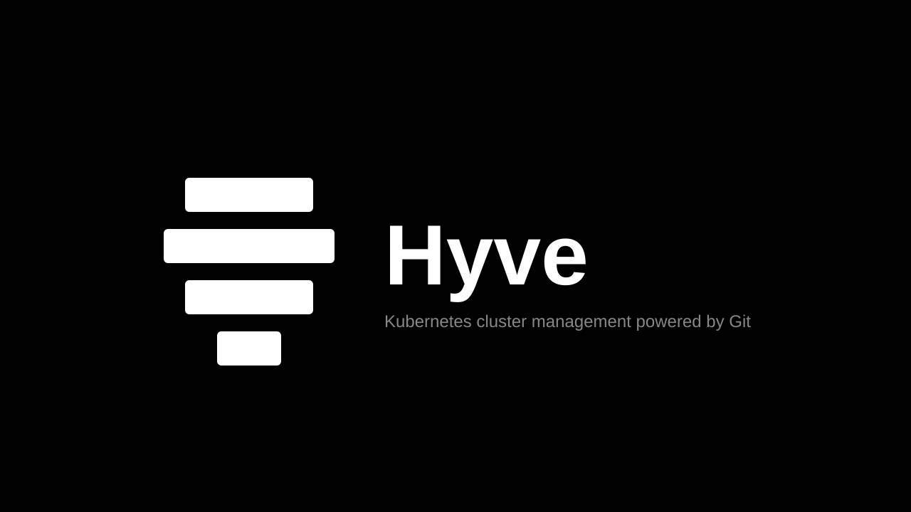

<p align="center">
  
</p>

# Hyve

Kubernetes clusters as code. Describe a cluster in YAML and Hyve creates, updates, and deletes it to match — on your laptop, in a pipeline, or as a controller in your cluster.

[](https://cbridges1.github.io/hyve-website/)
[](LICENSE)

## Run it where you need it

- **Locally** — `hyve reconcile` against a directory. Git-backed if you want history and review; a plain folder if you don't.
- **In pipelines** — the same command from CI, e.g. clusters created for a test run and torn down after.
- **In Kubernetes** — a controller plus an API and web console for your team. Reconcile on the cluster Hyve runs on, or point each organization at a separate reconciling cluster to keep the app apart from the work.

The same YAML and the same engine everywhere: locally a cluster is a file, in Kubernetes a custom resource.

## Bring your own provisioner

How a cluster gets built is up to a **module** — a small, versioned set of scripts (create, status, scale, auth, delete). Anything you can script works: Terraform, Crossplane, Cluster API, or a provider's own CLI. Hyve embeds no cloud SDKs; credentials stay where your tools already keep them.

**Cluster API is first-class:** [hyve-capi-module](https://github.com/cbridges1/hyve-capi-module) builds clusters from any ClusterClass on any provider Cluster API supports — on a management cluster you already run, or a kind cluster it starts for local runs and pipelines. `hyve module init` scaffolds your own.

Templates stamp out clusters to a pattern, lifecycle hooks (`beforeCreate`, `onCreate`, `afterCreate`, `onDelete`, `afterDelete`) run workflows around each change, and `hyve cluster auth` hands you a working kubeconfig.

## Install

```bash
go install github.com/cbridges1/hyve@latest
```

Needs Go 1.26+, and `git` on your `PATH` (hyve fetches modules with it). Make sure `$(go env GOPATH)/bin` is on your `PATH` too.

## Quick start

```bash
hyve module add github.com/your-org/hyve-civo-module   # placeholder module
hyve context create --path .                            # any directory; git optional

hyve template create civo --driver github.com/your-org/hyve-civo-module \
  --driver-version latest --region PHX1 --set node_count=3
hyve cluster create my-cluster --template civo          # writes clusters/my-cluster.yaml

hyve reconcile                                          # provisions it and runs hooks
hyve cluster auth my-cluster && kubectl get nodes
```

Every file Hyve writes is a real `hyve.io/v1alpha1` custom resource (`ClusterDefinition`, `Template`, `Workflow`). You can `kubectl apply` them to a cluster running Hyve's controller unchanged.

## Cluster mode

Deploy the controller + API with Helm, then point the CLI at it:

```bash
helm install hyve oci://ghcr.io/cbridges1/charts/hyve --version <version> \
  --namespace hyve-system --create-namespace \
  --set api.publicBaseURL=https://hyve.example.com \
  --set api.bootstrapAdmin.username=admin \
  --set api.bootstrapAdmin.passwordSecret.name=hyve-admin   # Secret with a "password" key

hyve context login --api-url https://hyve.example.com   # username or email + password
hyve organization list                                 # the organizations you can access
hyve organization use acme                             # act in acme from now on
hyve cluster list --org widget                         # or pick one for a single command
```

One login reaches every organization you're a member of — pick one with `hyve organization use` or `--org` (the "Viewing" picker in the console).

- The chart creates a `hyve-api` ClusterIP Service and no Ingress — expose it with TLS your own way.
- `api.db.*` picks SQLite (default, one replica) or Postgres (needed to scale or use reconciling clusters). See `deploy/helm/hyve/values.yaml`.
- One install serves many **organizations**, each optionally on its own **reconciling cluster** (`hyve reconciling-cluster add/use`); `api.requireReconcilingCluster` keeps every organization off the cluster Hyve runs on. See [docs/ARCHITECTURE.md](docs/ARCHITECTURE.md).
- `hyve migrate <dir> --write` moves local state into a cluster (without `--write`, a dry run).

> Helm only installs CRDs on first install. After a CRD change, run `kubectl apply -f deploy/helm/hyve/crds/` before `helm upgrade`.

## Modules

| File | Operation |
|------|-----------|
| `status.sh` / `.yaml` | Report whether the cluster exists and its state |
| `create.sh` / `.yaml` | Provision the cluster |
| `delete.sh` / `.yaml` | Destroy the cluster |
| `auth.yaml` | Print `HYVE_KUBECONFIG_B64=<kubeconfig>` |
| `scale.sh` / `.yaml` | Apply param changes (optional) |

Params arrive as `HYVE_PARAM_*` env vars. Operations print `HYVE_KEY=value` lines, which are saved as `driverOutputs` and passed to later runs. See the [module authoring guide](https://cbridges1.github.io/hyve-website/docs/guides/module-authoring).

## Development

```bash
task build          # build the binary
task check          # go vet + tests
task cluster:local && task install:local   # local k3d dev install
```

Every push to a branch builds `ghcr.io/cbridges1/hyve` and `ghcr.io/cbridges1/hyve-agent` (amd64 and arm64), tagged `sha-<commit>` and `<branch>`; `v*` tags build the releases.

Run `task --list` for the rest. See [docs/ARCHITECTURE.md](docs/ARCHITECTURE.md) and [docs/TESTING.md](docs/TESTING.md). Full docs are at **[cbridges1.github.io/hyve-website](https://cbridges1.github.io/hyve-website/)**.
